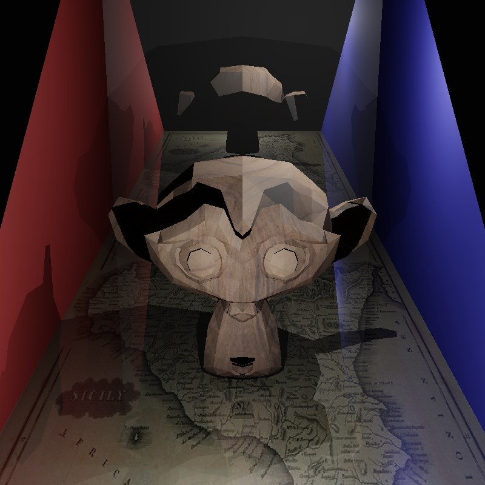
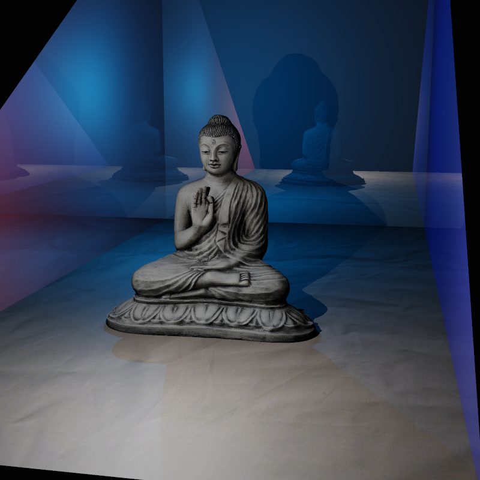

This raytracer was written for the University of Edinburgh Computer Graphics course. It was built out from the template code provided, which only contained function definitions with no implementation. 

Here are some example images generated by the raytracer!

